# Estrutura de dados

## Arrays

  Array, também conhecida como matriz e vetor, é um espaço na memória, reservado para guardar dados de modo ordenado, ou seja, para cada linha, uma informação e é uma das estruturas de dados mais utilizadas pela sua simplicidade. 
  
  As arrays possuem tamanhos fixos e a diferença entre um vetor e uma matriz  é que o vetor é um array de apenas 1 dimensão e a matriz é um array de 2 (ou mais) dimensões.
  
  Exemplo de array vetor:
 
  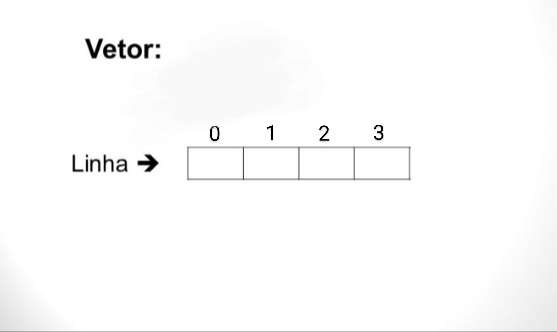
  
  Exemplo de array matriz:

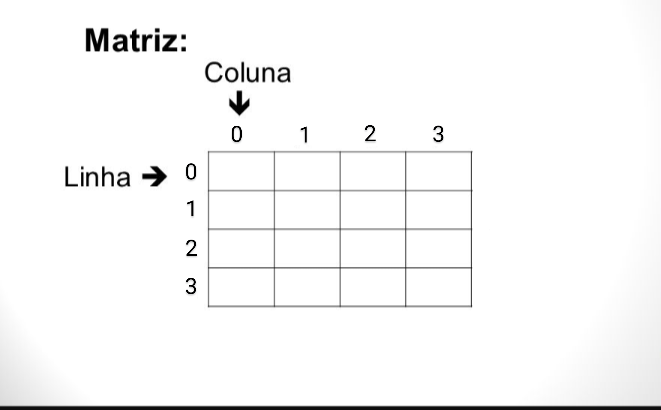

 Apos colocar os respectivos dados na memoria não se pode mudar.
  
## Listas

 É um conjunto de estruturas chamadas de "nós". O nó é quem armazena as informações para a lista gerenciar. Existem dois tipos de listas: as listas ligadas e as listas duplamente ligadas.
 
 As listas ligadas somente conseguem ver que vem despois, ou seja, ela somente anda para frente, enquanto a lista duplamente ligada consegue ver quem vem depois e quem veio anteriormente, assim ela anda para frente e para trás.
 
 
 Exemplo lista ligada:
 
 
 
 Exemplo lista duplamente ligada:
 
 
 
 
## Pilhas

 A pilha é considerada uma estrutura de dados simples, sendo fácil de implementar. As pilhas trabalham com o formato LIFO (o último a entrar é o primeiro a sair, “Last In, First Out”, em inglês). 
 
 Lembre-se da pilha como uma pilha de livros, em que o primeiro livro que foi inserido na pilha, normalmente é o último que sai dela, enquanto o último adicionado é o primeiro a ser retirado.
 
 
 
  Exemplo do formato LIFO com as operações push (empilhar) e pop (desempilhar):
  
  

## Filas

 A estrutura de dados fila segue também um formato padrão, igualmente a pilha, porém ao contrario, conhecido como formato FIFO (o primeiro a entrar é o primeiro a sair, “First In, First Out”, em inglês).
 
  Lembre-se da fila como uma fila de banco, em que o primeiro a chegar da fila é o primeiro a ser atendido, ou seja, primeiro a sair da fila.
  
  
  
  Exemplo do formato LIFO com as operações enqueue (enfileirar) e dequeue (desenfileirar):
  
  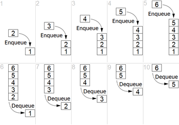

## Tabela hash

 A tabela hash, também conhecida por tabela de espalhamento, é uma estrutura de dados especial, que associa chaves de pesquisa (hash) a valores. Seu objetivo é, a partir de uma chave simples, fazer uma busca rápida e obter o valor desejado.
  
  Exemplo de uma tabela hash:
  
  

## Grafo

 Um grafo é uma coleção de vértices (V) (pontos ou circulos) e uma coleção de arcos (E)(linhas entre esse pontos ou entre circulos) constituídos por pares de vértices. É uma estrutura usada para representar um modelo em que existem relações entre os objectos de uma certa coleção.

  Exemplo de um grafo:
  
  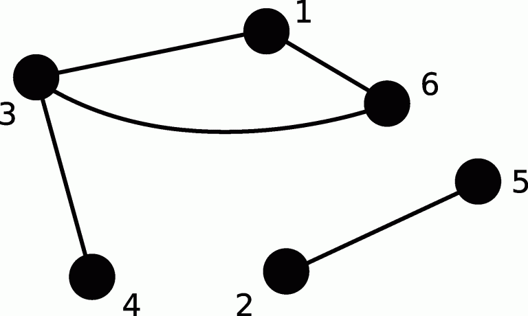
  
   No exemplo acima, conseguimos ver que : V = {1, 2, 3, 4, 5, 6} e E = {(1,3), (1,6), (2,5), (3,4), (3,6)

## Árvores

 A estrutura de dados árvore é uma das mais importantes estruturas não lineares. Ela tem as características topologica de uma árvore. Diferente das listas, em que os dados se encontram numa sequência, nas árvores, os dados estão em forma hierárquica.
 
 A imagem abaixo ilustra a representação de uma árvore, onde é possível perceber a analogia do termo utilizado para a estrutura.
 
 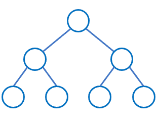
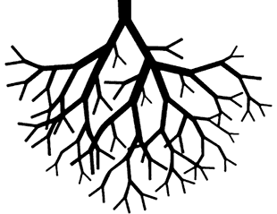

A estrutura arvore armazena seus dados em nós (nodos). Existe o nó raiz, os nós filhos e pais, e os nós folhas.

Exemplo: 
- Nó raiz :

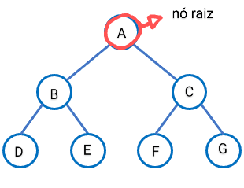

- Nós pais e filhos:

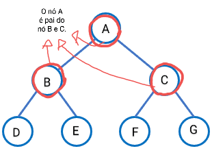

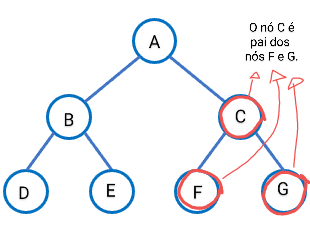

- Nós folhas :

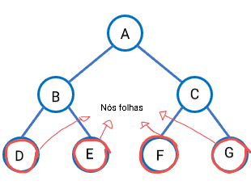

 Abaixo uma imagem bonitinha para ser lembrado dos nós folhas 😊❣️⬇️

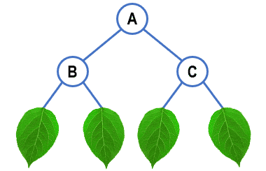
