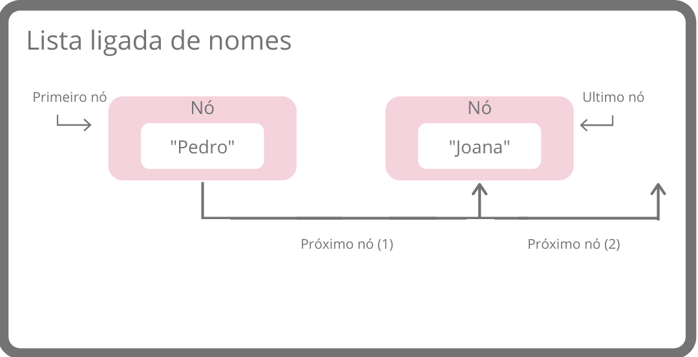
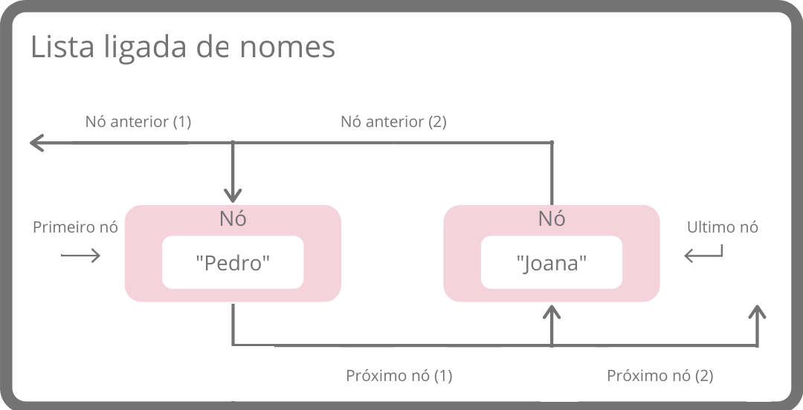

# Estrutura de dados

## Arrays

  Array, também conhecida como matriz e vetor, é um espaço na memória, reservado para guardar dados de modo ordenado, ou seja, para cada linha, uma informação e é uma das estruturas de dados mais utilizadas pela sua simplicidade. 
  
  As arrays possuem tamanhos fixos e a diferença entre um vetor e uma matriz  é que o vetor é um array de apenas 1 dimensão e a matriz é um array de 2 (ou mais) dimensões.
  
  Exemplo de array vetor:
 
  |:---------:|:----------:|:---------:|:----------:|
  | João  | Ana    | Pedro | Julia |
  | **0** | **1** | **2** | **3** |
  
  Exemplo de array matriz:

|:---------:|:----------:|:---------:|:---------:|:---------:|
|            | **0** | **1** | **2** | **3**  |
| **0** | João   | Sara  | Darla | Sandro |
| **1** |  Ana    | Bento | Fabio | Maria |
| **2** | Pedro | Lucia | Paulo|   Luis    |
| **3** | Julia   | Otavio | Lais |   Kelly   | 

 Apos colocar os respectivos dados na memoria não se pode mudar.
  
## Listas

 É um conjunto de estruturas chamadas de "nós". O nó é quem armazena as informações para a lista gerenciar. Existem dois tipos de listas: as listas ligadas e as listas duplamente ligadas.
 
 As listas ligadas somente conseguem ver que vem despois, ou seja, ela somente anda para frente, enquanto a lista duplamente ligada consegue ver quem vem depois e quem veio anteriormente, assim ela anda para frente e para trás.
 
 
 Exemplo lista ligada:
 
 
 
 Exemplo lista duplamente ligada:
 
 
 
 
## Pilhas

## Filas

## Tabela Hasing

## Grafo

### Arvores
